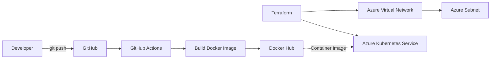

# Azure Kubernetes Todo API

A cloud-native DevOps project demonstrating how a containerised Node.js application can be packaged with Docker, integrated with a CI pipeline, and supported by Azure Kubernetes Service infrastructure provisioned using Terraform.

The application itself is intentionally lightweight. The main focus of the project is the infrastructure, containerisation and automated delivery workflow.

## Architecture



The project is divided into two main workflows:

**Infrastructure workflow**

Terraform provisions the Azure networking and Kubernetes infrastructure, including:

* Azure Virtual Network
* Dedicated subnet
* Azure Kubernetes Service cluster
* AKS managed identity
* Kubernetes worker node pool

**Application delivery workflow**

Code pushed to the `main` branch triggers GitHub Actions, which:

1. Checks out the application source.
2. Configures Node.js 20.
3. Installs application dependencies.
4. Generates a versioned Docker image tag.
5. Authenticates with Docker Hub.
6. Builds the application container.
7. Pushes both versioned and `latest` images to Docker Hub.

## Technology Stack

| Area                    | Technology                     |
| ----------------------- | ------------------------------ |
| Cloud Platform          | Microsoft Azure                |
| Container Orchestration | Azure Kubernetes Service (AKS) |
| Infrastructure as Code  | Terraform                      |
| Containerisation        | Docker                         |
| CI                      | GitHub Actions                 |
| Container Registry      | Docker Hub                     |
| Application             | Node.js, Express               |
| Local Development       | Docker Compose                 |
| Networking              | Azure Virtual Network, Subnet  |
| Source Control          | Git, GitHub                    |

## Project Structure

```text
Todo-app-source/
├── .github/
│   └── workflows/
│       ├── ci.yml
│       └── main.yml
│
├── app/
│   ├── Dockerfile
│   ├── index.js
│   ├── package.json
│   └── package-lock.json
│
├── Terraform/
│   ├── aks.tf
│   ├── network.tf
│   ├── provider.tf
│   └── .terraform.lock.hcl
│
├── docker-compose.yml
├── .dockerignore
├── .gitignore
└── README.md
```

## Application

The application is a simple REST API built with Node.js and Express.

It exposes the following endpoints:

| Method | Endpoint     | Purpose                  |
| ------ | ------------ | ------------------------ |
| GET    | `/`          | Application health check |
| GET    | `/todos`     | Retrieve all todo items  |
| POST   | `/todos`     | Create a todo item       |
| PUT    | `/todos/:id` | Update a todo item       |
| DELETE | `/todos/:id` | Delete a todo item       |

Example health check:

```bash
curl http://localhost:3000/
```

Expected response:

```text
Todo API is running 🚀
```

## Running the Application Locally

Clone the repository:

```bash
git clone https://github.com/KennySuleiman/Todo-app-source.git
cd Todo-app-source
```

Start the environment:

```bash
docker compose up --build
```

The API is then available at:

```text
http://localhost:3000
```

## Docker

The application uses a lightweight Node.js 20 Alpine base image.

The container build:

* Sets `/app` as the working directory.
* Copies the package manifests.
* Installs production dependencies.
* Copies the application source.
* Exposes port `3000`.
* Starts the Express API using Node.js.

Build the image manually with:

```bash
docker build -t todo-api ./app
```

Run it with:

```bash
docker run -p 3000:3000 todo-api
```

## Infrastructure as Code

Terraform is used to define the Azure infrastructure.

Move into the Terraform directory:

```bash
cd Terraform
```

Initialise Terraform:

```bash
terraform init
```

Review the proposed infrastructure:

```bash
terraform plan
```

Provision the infrastructure:

```bash
terraform apply
```

### Azure Networking

Terraform creates a virtual network named:

```text
crud-vnet
```

with address space:

```text
10.0.0.0/16
```

A dedicated subnet named:

```text
crud-subnet
```

uses:

```text
10.0.1.0/24
```

### Azure Kubernetes Service

Terraform provisions an AKS cluster named:

```text
crud-aks
```

in:

```text
East US
```

The cluster uses:

* A single default node.
* `Standard_D2s_v7` VM size.
* System-assigned managed identity.
* Azure Kubernetes Service for container orchestration.

## CI Pipeline

The GitHub Actions workflow runs whenever code is pushed to the `main` branch.

The pipeline performs the following workflow:

```text
Git Push
   ↓
GitHub Actions
   ↓
Checkout Source
   ↓
Configure Node.js
   ↓
npm ci
   ↓
Generate Version Tag
   ↓
Docker Build
   ↓
Docker Hub Authentication
   ↓
Push Container Image
```

Container images are published to:

```text
kennysul/todo-app-source-app
```

The pipeline generates version tags using the deployment date and shortened Git commit SHA.

Example:

```text
v2026.09.03-a1b2c3d
```

It also publishes:

```text
latest
```

This provides both an immutable version reference and a convenient latest image.

## Security Practices

The project avoids storing Docker Hub credentials directly in the repository.

GitHub Actions retrieves authentication details from GitHub repository secrets:

```text
DOCKER_USERNAME
DOCKER_PASSWORD
```

Environment files and Terraform state are excluded from version control using `.gitignore`.

Terraform state should be treated as sensitive because it can contain infrastructure configuration and potentially sensitive resource information.

## Repository Hygiene

The following files are intentionally excluded from Git:

```text
.env
.env.*
*.tfstate
*.tfstate.*
.terraform/
node_modules/
```

This helps prevent local configuration, secrets and Terraform state from being committed to the repository.

## Current Project Scope

The current GitHub Actions workflow provides **continuous integration and container publishing**.

It automatically builds and pushes the application image to Docker Hub.

The Azure Kubernetes infrastructure is provisioned separately with Terraform.

Automated deployment of each newly built container image from GitHub Actions into AKS is a logical next stage of the project and is not represented here as already implemented.
## Kubernetes Validation with Minikube

The Kubernetes deployment was validated locally using Minikube before any live AKS deployment.

The application was deployed using:

```bash
kubectl apply -f kubernetes/deployment.yaml
kubectl apply -f kubernetes/service.yaml
```

The Kubernetes configuration includes:

* Two application replicas
* A `ClusterIP` service
* Container port `3000`
* HTTP readiness probe
* HTTP liveness probe
* Docker image pulled from Docker Hub

The running application was exposed locally using port forwarding:

```bash
kubectl port-forward service/todo-api-service 8080:80
```

The API health endpoint returned:

```text
Todo API is running 🚀
```

A todo item was successfully created using:

```bash
curl -X POST http://localhost:8080/todos \
  -H "Content-Type: application/json" \
  -d '{"task":"Deploy application to Kubernetes"}'
```

and retrieved through:

```bash
curl http://localhost:8080/todos
```

This validated the complete local application flow:

```text
Docker Hub
    ↓
Kubernetes Deployment
    ↓
Two Application Pods
    ↓
ClusterIP Service
    ↓
Port Forward
    ↓
REST API
```

Minikube was used intentionally to validate the Kubernetes workload locally without maintaining billable Azure AKS resources.

## Future Improvements

The project can be extended by:

* Adding Kubernetes Deployment and Service manifests.
* Automatically deploying versioned images to AKS.
* Adding automated application tests to the CI pipeline.
* Adding linting and code-quality checks.
* Connecting the API to PostgreSQL for persistent storage.
* Moving Terraform state to a secure Azure Storage backend.
* Adding Kubernetes health probes.
* Implementing application monitoring with Prometheus and Grafana.
* Adding HTTPS and ingress routing.
* Using GitHub OIDC for passwordless Azure authentication.
* Introducing GitOps using Argo CD once Kubernetes deployment manifests are established.

## Key DevOps Skills Demonstrated

This project demonstrates practical experience with:

* Azure cloud infrastructure
* Azure Kubernetes Service
* Infrastructure as Code
* Terraform
* Docker containerisation
* GitHub Actions
* CI pipeline design
* Docker image versioning
* Container registry integration
* Azure networking
* Linux-based containers
* Git and GitHub
* REST API deployment concepts

## Author

**Kehinde Suleiman**

Cloud & DevOps Engineer

[GitHub](https://github.com/KennySuleiman)

