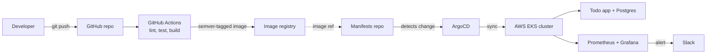

# Todo-app-source
Deploying a cloud native software app

# Cloud-Native Todo App

A deliberately simple CRUD app, deployed the way production systems actually ship: containerized, provisioned with Terraform on AWS EKS, deployed via GitOps with ArgoCD, and monitored with Prometheus and Grafana.

The application logic is intentionally minimal — the goal of this project was to practice infrastructure and delivery, not application code.

[](https://github.com/YOUR_USERNAME/cloud-native-todo-app/actions)
[](https://github.com/YOUR_USERNAME/cloud-native-todo-app/commits/main)

## Architecture



**Flow:** push to `main` → CI lints, tests, builds, and pushes a versioned image → the image tag is updated in a separate manifests repo → ArgoCD detects the change and syncs the cluster → Prometheus/Grafana monitor the result and alert on failure.

## What this covers

| Area | Tooling | Outcome |
|---|---|---|
| Containerization | Docker, docker-compose | Multi-stage build, app + Postgres run locally with one command |
| Infrastructure as Code | Terraform | VPC, public/private subnets, and EKS cluster — zero manual console steps |
| CI | GitHub Actions | Lint → test → build → push, tagged with semantic versioning (not `latest`) |
| GitOps delivery | ArgoCD | Cluster state is driven entirely from Git; deploying is a `git push`, not a manual `kubectl apply` |
| Observability | Prometheus, Grafana, Helm | Live dashboards for CPU, memory, request success rate; Slack alert on downtime |

## Repo structure

```
cloud-native-todo-app/
├── app/                     # Todo CRUD app + Dockerfile
├── infra/                  # Terraform: VPC, EKS cluster
│   ├── main.tf
│   ├── vpc.tf
│   └── eks.tf
├── .github/workflows/       # CI pipeline definition
│   └── ci.yml
├── docs/                    # Architecture diagram, screenshots
├── docker-compose.yml
└── README.md
```

Kubernetes manifests (Deployments, Services, Ingress) live in a separate repo — [`Todo-app-gitops`](https://github.com/YOUR_USERNAME/Todo-app-gitops) — which is the repo ArgoCD watches. Keeping app code and cluster state in separate repos is intentional; it's the core principle of GitOps.

## Running it locally

```bash
git clone https://github.com/YOUR_USERNAME/Todo-app-source
cd Todo-app-source
docker compose up --build
```

The app will be available at `http://localhost:3000`.

## Provisioning the cloud infrastructure

```bash
cd infra
terraform init
terraform plan
terraform apply
```

This provisions a VPC with public/private subnets and an AWS EKS cluster. Connect `kubectl` to it with:

```bash
aws eks update-kubeconfig --name todo-cluster --region us-east-1
```

## Deploying

Deployment happens through ArgoCD, not manually. Install ArgoCD into the cluster:

```bash
kubectl create namespace argocd
kubectl apply -n argocd -f https://raw.githubusercontent.com/argoproj/argo-cd/stable/manifests/install.yaml
```

Point an ArgoCD `Application` at the manifests repo and enable auto-sync. From that point on, updating the image tag in the manifests repo is the only step needed to ship a new version.

## Monitoring

The kube-prometheus-stack is installed via Helm:

```bash
helm repo add prometheus-community https://prometheus-community.github.io/helm-charts
helm install monitoring prometheus-community/kube-prometheus-stack \
  --namespace monitoring --create-namespace
```

Grafana dashboards track CPU, memory, and HTTP success rate. Alertmanager is configured to post to Slack if the app's `up` metric drops to zero.

## Screenshots

| Grafana dashboard | ArgoCD sync view |
|---|---|
|  |  |

## What I'd improve next

- Promote images across environments (dev → staging → prod) using ArgoCD ApplicationSets instead of a single manifests branch
- Add a service mesh (Istio or Linkerd) for traffic shaping and mutual TLS
- Move secrets out of plain Kubernetes Secrets and into Sealed Secrets or Vault

## Tech stack

Docker · Terraform · AWS EKS · GitHub Actions · ArgoCD · Prometheus · Grafana · Helm · PostgreSQL


